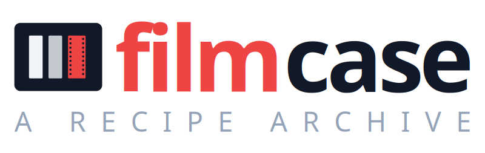
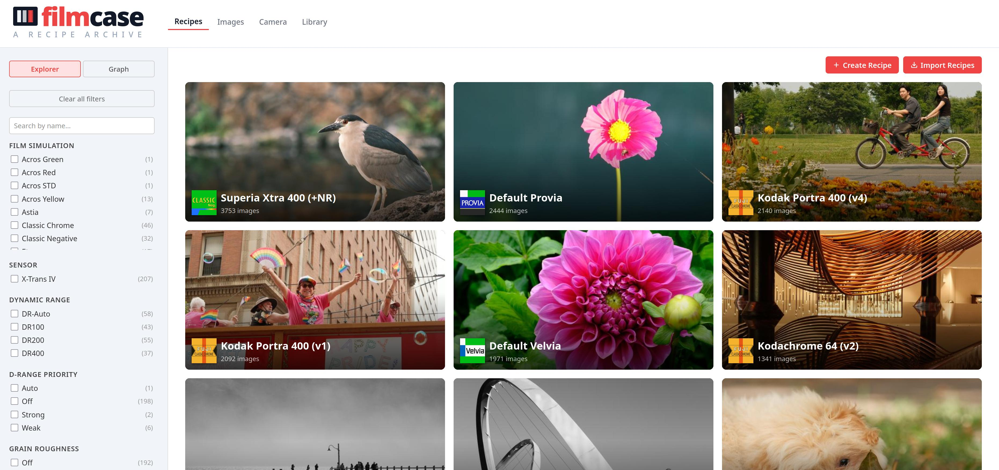
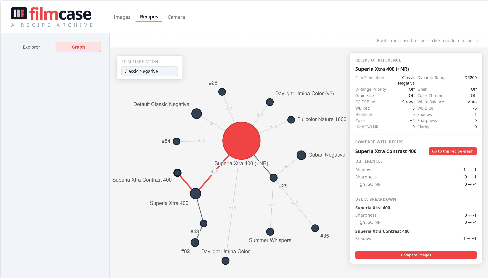
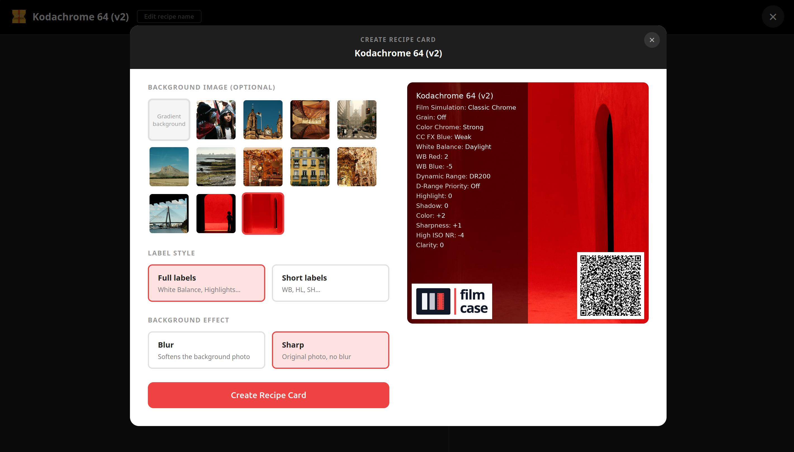
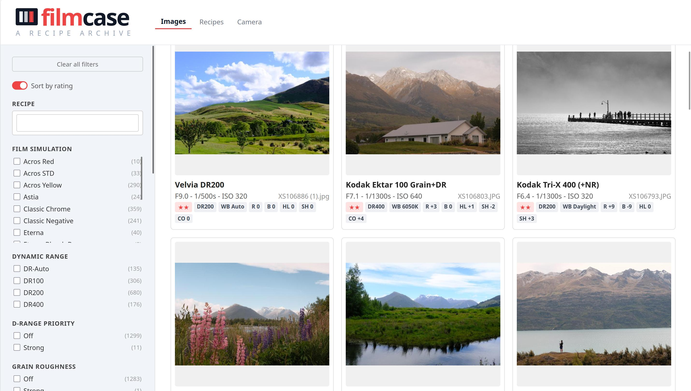
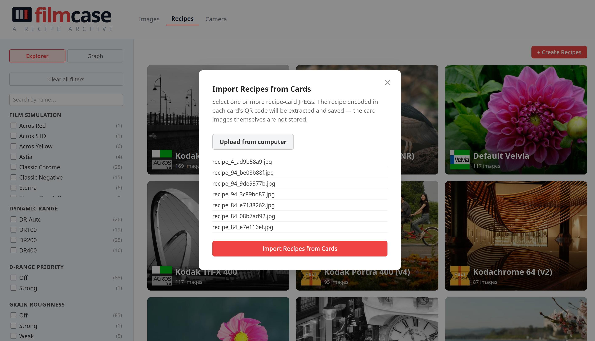

Filmcase is a Django application for managing Fujifilm camera recipes and browsing your image catalog. It reads EXIF data from your JPEG files, matches images to the Fujifilm recipe they were shot with, and lets you filter and group your catalog by recipe. You can push recipes directly to your camera over USB and explore relationships between recipes through an interactive graph.

Read more about it in our [documentation index](docs/index.md).





## Features

- Import Fujifilm JPEGs to **build your image catalog and recipe collection**, then browse them in a filterable gallery
- **Push your recipes to your camera**'s custom slots over USB
- Browse and search your recipe collection with faceted filtering by film simulation, dynamic range, grain, and more
- **Generate shareable recipe cards** so other Fujifilm shooters can import your recipes
- **Import recipes** from a Fujifilm JPEG or a shared recipe card (QR code)
- **Explore relationships between recipes** through an interactive graph, compare differences side by side, and trace how your recipes evolved from one another
- View full-resolution images with their complete recipe and EXIF data
- Rate images (0–5 stars) individually or in bulk from the command line
- Sort the gallery by rating to surface your best shots first
- Customize the cover image shown for each recipe

---





## Installation

Three installation modes are available depending on your needs:

|                            | Lite (user-only)              | Full (developer)               | Docker (any server)             |
| -------------------------- | ----------------------------- | ------------------------------ | ------------------------------- |
| **Database**               | SQLite (file, no server)      | PostgreSQL                     | PostgreSQL (container)          |
| **Broker / worker**        | None                          | RabbitMQ + Celery              | RabbitMQ + Celery (containers)  |
| **Image processing**       | Sequential (one at a time)    | Parallel (N workers)           | Parallel (N workers)            |
| **OS services to install** | None                          | PostgreSQL, RabbitMQ           | Docker only                     |
| **Served over**            | HTTP on localhost             | HTTP on localhost              | HTTPS, self-signed certificate  |
| **Push recipes to camera** | Yes                           | Yes                            | Yes, over WebUSB (Chromium)     |
| **Best for**               | Personal use, small libraries | Development, large collections | Always-on servers, remote access |

### Lite install (recommended for personal use)

No database server or message broker required.

**Clone and install system dependencies:**

```bash
git clone <repo-url>
cd filmcase
./setup.sh lite   # installs Python, libusb, exiftool (macOS and Ubuntu)
```

**Set up the project:**

```bash
make setup-lite              # creates venv, installs deps, generates SQLite config, runs migrations
make start                   # sync library and start the development server
```

Then open the Library page and click **Add Folder** to import your photo collection.

---

### Full install (for development and large collections)

Parallel image processing via Celery. Requires PostgreSQL and RabbitMQ.

**Install system dependencies:**

```bash
./setup.sh full   # installs Python, libusb, exiftool, PostgreSQL, RabbitMQ (macOS and Ubuntu)
```

This script is idempotent — re-running it skips anything already in place.

**Set up the project:**

```bash
make setup-full   # creates venv, installs deps, generates PostgreSQL config, runs migrations
```

**Start the worker and server** (in separate terminals):

```bash
make worker   # start a Celery worker for parallel image processing
make start    # sync library and start the Django development server
```

The worker must be running before `make start`, because the sync checks for a reachable
worker before enqueuing tasks and skips the sync if none is found.

---

### Docker install (any always-on server)

Runs the full stack in containers, with nothing to install on the host but Docker itself.

```bash
./setup.sh docker
```

That asks for the address you will browse to, the photo directories to import, and how many
processes to run, filling in your LAN address and user id as defaults. It generates the
signing key and database password itself, writes `.env` and `docker-compose.override.yml`,
and offers to build and start. Nothing is installed on the host and no file needs editing.

Re-run `./setup.sh docker` any time you want to change a setup option (the address, ports,
process counts, or photo directories): your previous choices come back as the prompt
defaults, and the generated signing key and database password are kept rather than
regenerated.

Then open `https://<FILMCASE_HOST>:8443/` and accept the certificate warning once.

Two things behave differently from a native install:

- **It is served over HTTPS with a self-signed certificate**, so every browser shows a
  warning the first time. That is the cost of not owning a domain, and it buys a secure
  context, which browsers require before exposing USB and other capabilities.
- **Pushing recipes to a camera runs from your browser over WebUSB**, the default for a
  Docker install, so it works even on a headless NAS; it needs a Chromium browser, and
  `/camera/diagnostics/` reports whether yours can reach the camera.

Full details, including how to swap in a trusted certificate, are in
[docs/docker.md](docs/docker.md).

> **Filmcase has no authentication.** Anyone who can reach the port has full access,
> including the Library page that browses the filesystem. Do not expose it to the internet.

### Installing by hand

Prefer to install the dependencies and set up the project yourself, without the setup
script? See [docs/manual_install.md](docs/manual_install.md).

---

## Updating

To pull the latest changes, install any new dependencies, and apply pending migrations in one step:

```bash
make update          # lite and full installs
make docker-update   # Docker install
```

The Docker variant rebuilds the image and restarts instead of touching a virtualenv. It
builds before it replaces anything, so a failed build leaves the running stack untouched.
Avoid running it while a library sync is in progress: see
[docs/docker.md](docs/docker.md#updating).

---

## How to run

```bash
make start
```

This syncs your registered library folders (importing any new images found since the last
run) and then starts the Django development server. Open
[http://localhost:8000/](http://localhost:8000/) in your browser — you will land on the
recipes explorer.

If you only want to start the server without running a sync first, use `make run` instead.

---

## How to use

Filmcase does far more than fits here: browsing and filtering your catalog, rating images,
managing library folders, pushing recipes to your camera, exploring recipe graphs, and more.
Two documents cover it in full:

- [docs/web_interface.md](docs/web_interface.md) for everything you can do from the web app.
- [docs/management_commands.md](docs/management_commands.md) for the command-line tools.

---

## Camera compatibility

The only model this project has been tested on is the **Fujifilm X-S10**. Based on analysis of the PTP property codes used (custom slot registers `0xD18C`–`0xD1A5`), any **X-Trans IV** camera (X-T3, X-T4, X-T30, X-T30 II, X-S10, X100V, X-Pro3, X-E4, X-H1) should work, and **X-Trans V** models (X-T5, X-T50, X-H2, X-H2S, X100VI, X-E5, X-M5) are likely compatible too. Earlier generations (X-Trans III and below) do not implement the custom slot registers and will not work.

If you test on a model not listed here, please open an issue to report the result.

---

## Safety and disclaimer

We have observed experimentally that the camera firmware rejects invalid PTP property values — the X-S10 will not accept out-of-range or malformed writes, so mis-configured recipes should not be applied. That said, **this software is provided as-is, with no warranty of any kind**. We are not responsible for any damage, data loss, or malfunction caused to any camera or device by using this software. Use it at your own risk.

---

## License

This project is licensed under the [GNU General Public License v3.0](LICENSE).

---

## Development

Pull requests are welcome. See [docs/contributing.md](docs/contributing.md) for the full guide: local environment setup, testing strategy, PR requirements, and review conventions.
