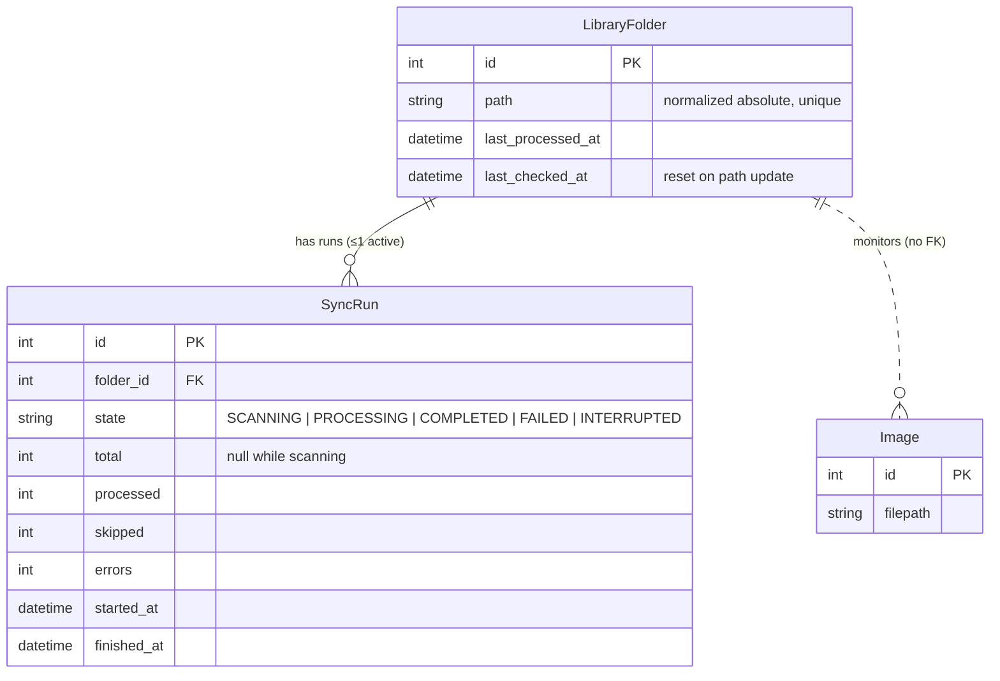
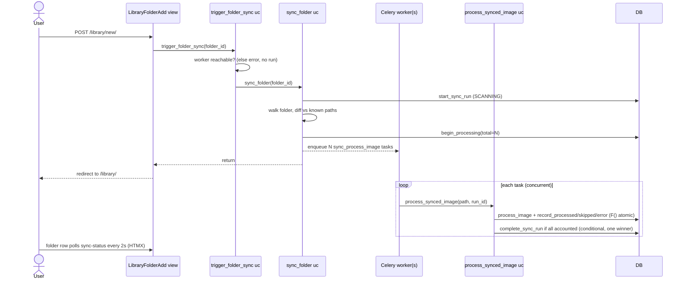
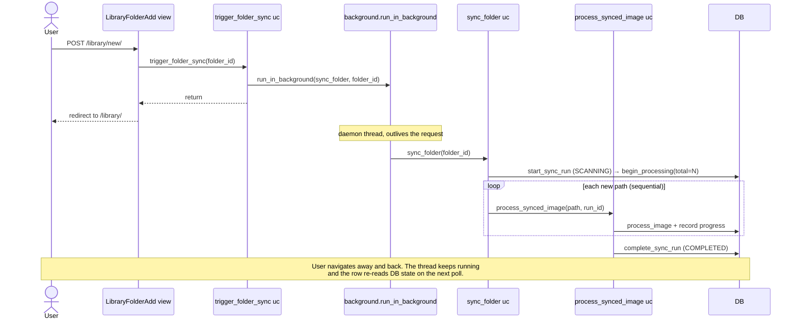

# ADR 011 — Library sync on folder add/update

**Status**: Accepted
**Date**: 2026-07-02

---

## Context

ADR 010 introduced the Library: a list of `LibraryFolder` rows the app monitors, and a **startup** sync (`make start` runs `manage.py sync_library`) that walks every folder and imports new images. That covered the "detect new photos over time" need, but it deliberately did nothing while the app is running.

The Library page (added alongside ADR 010) already lets the user add a folder, update a folder's path, and remove a folder, each through a use case. But those actions only change the monitored **list**. Nothing is imported until the next restart. A user who registers a folder full of photos sees it appear in the table and then... nothing happens, with no feedback and no obvious reason. The catalog silently lags behind the library until `make start` is run again.

The app ships in two modes (ADR 003): **lite** (SQLite, no broker, `process_image` runs inline) and **full** (PostgreSQL + Celery, `process_image` runs in a worker). Any solution has to behave sensibly in both.

---

## Problem

Triggering the import from a web request is not as simple as calling the sync in the view — several forces make a naive implementation fail:

- A folder's first import can be tens of thousands of files, so running it inside the request would hang the page or time out.
- The two install modes process images differently — inline in lite, enqueued to a worker in full — so a single trigger has to serve both.
- Once the work runs outside the request, its progress must live somewhere durable, so the UI can show it and it survives the user leaving the page.
- The image-processing code is shared with the manual `import` command, so sync-specific state must not leak into it.
- The process doing the work can die mid-run, leaving partial progress that must be recoverable.

So: how do we run a potentially long import off the request, in both modes, with visible and recoverable progress, without contaminating the shared processing code?

Removal is out of scope for importing: ADR 010 is add-only (the sync never deletes images), so removing a folder just deregisters it.

---

## Options considered

The central question is **how the triggered sync runs** relative to the HTTP request.

### Option A — Run the sync synchronously inside the request

The add/update view calls the sync directly and returns when it finishes.

**Why we did not choose this option:**

In full mode this is tolerable (the request only enqueues Celery tasks and returns), but in lite mode the request itself runs `process_image` for every new file. A first import of a large folder would hang the page for minutes and risk a proxy/browser timeout. It also fails problem (2): the work is tied to the request, so navigating away or a dropped connection could interrupt it.

### Option C — Run the lite-mode sync in a detached subprocess

Spawn `manage.py sync_library --folder <id>` as an independent OS process.

**Why we did not choose this option:**

It solves (1) and (2), and it even survives a web-process reload. But it is heavier: process spawning, argument plumbing, and status coordination that can only happen through the database anyway. The durability advantage over a thread — surviving a web reload — is already provided by the startup sync, which idempotently catches up on the next `make start`. The extra machinery is not justified for a single-user local app.

### Option B — Decide the execution strategy in a use case; run lite in a background thread (chosen)

A `trigger_folder_sync` **use case** decides how to run the sync based on the mode. In full mode it runs the single-folder sync inline (which only enqueues tasks and returns fast). In lite mode it hands the sync to a background daemon thread via a small `services/background.py` runner, so the request returns immediately while the thread processes images server-side. Progress is persisted in the database and polled over HTMX.

**Why this was chosen:**

- The thread lives in the web process, independent of the request, so it satisfies (2) directly: leaving the page only stops the polling, not the work.
- Putting the celery-vs-thread choice in a use case (not the view) keeps the decision in the application layer; the view just calls the use case, and raw threading stays behind a service, mirroring how `workertasks.enqueue_task` hides Celery.
- The startup sync remains the catch-up net, so the thread's one weakness — dying on a web-process reload — is already covered without a subprocess.

---

## Decision

- **Trigger only on add and path-update.** Remove stays pure deregistration. A path-update additionally resets `last_checked_at`, because the repointed tree is a different directory and mtime gating would otherwise skip its older subdirectories.

- **Single-folder scope.** The per-folder walk-and-dispatch logic is factored into a `sync_folder` use case. `sync_library` (startup) becomes a loop over `sync_folder`, so an add never re-walks every registered folder.

- **Execution strategy lives in `trigger_folder_sync`.** Full mode calls `sync_folder` directly (fast: it enqueues Celery tasks). Lite mode runs `sync_folder` in a daemon thread via `services/background.py`. The view only calls the use case.

- **Progress lives in a `SyncRun` model, polled over HTMX.** Because the sync runs server-side, its state must be durable and readable from any request. Each run records `state` (`SCANNING` → `PROCESSING` → `COMPLETED`/`FAILED`/`INTERRUPTED`), `total`, `processed`, `skipped`, `errors`, and timestamps. History is kept; the latest run per folder is shown. A conditional `UniqueConstraint` allows **at most one active run per folder**, which doubles as the "already syncing" guard.

- **Per-image work is composed, not coupled.** The domain `process_image` operation and the generic `process_image_task` (also used by the manual import command) stay sync-agnostic. A `process_synced_image` use case composes `process_image` with progress bookkeeping: it counts skips (`NoFilmSimulationError`) and errors, and finalises the run when every image is accounted for. Both interface adapters — a thin `sync_process_image_task` (full) and the thread loop (lite) — delegate to it.

- **SQLite tuning for lite concurrency.** WAL and a busy timeout are enabled via `DATABASES["OPTIONS"]`, derived from `DB_ENGINE`. WAL lets the foreground request threads read while the background thread writes; the busy timeout makes a colliding foreground write wait rather than raise "database is locked". Per-image transactions plus JPEG-only fast hashing keep write-lock holds tiny, so rating/recipe writes are never starved.

- **Crash recovery.** A run left `SCANNING`/`PROCESSING` when its process dies is marked `INTERRUPTED` at the start of the next `make start` sync, which then idempotently re-imports.

- **Full-mode worker-down.** `trigger_folder_sync` pings for a worker up front; if none responds it surfaces a Library-page error and creates no run (no stuck badge).

---

## Diagrams

### Data model

### Full mode — add folder triggers an enqueue-and-return sync

### Lite mode — add folder triggers a background thread

---

## Progress tracking

### Options considered

**Option 1 — Introspect the Celery queue / result backend.** Derive progress in full mode from broker queue depth or `inspect()`, or from a `GroupResult.completed_count()`.

*Rejected.* Broker/inspect counts are cluster-wide, not per-folder, and imperfect (queue depth vs reserved vs active); polling `inspect()` is a broadcast RPC. The clean `group`/`GroupResult` route needs a real result backend, but the app is configured with `rpc://`. None of it helps lite mode, which has no broker at all.

**Option 2 — A dedicated `SyncRun` table (chosen).** Each task/thread reports against a per-folder run row.

*Chosen.* It is per-folder-accurate, backend-agnostic, and identical across modes: lite's thread and full's tasks increment the **same** model, read by the **same** HTMX status endpoint. Under concurrent Celery workers, counters use atomic `F()` increments and completion is a conditional `UPDATE ... WHERE state = 'PROCESSING'` so exactly one finisher transitions the run and emits the completion event.

---

## Consequences

- New `SyncRun` model and migration; a `services/background.py` thread runner; `sync_folder`, `process_synced_image`, and `trigger_folder_sync` use cases; a `sync_process_image_task`; a sync-status view with HTMX polling in the folder row.
- `sync_library` becomes an all-folders loop over `sync_folder` that first interrupts dangling runs. The `manage.py sync_library` entry point and its result contract are unchanged.
- `process_image` and the generic `process_image_task` are untouched, so the manual `import` path is unaffected.
- Lite installs run with SQLite WAL enabled (a persistent, idempotent property of the database file).
- A new Celery task means the worker must be restarted after deploying this change before full-mode syncs will be processed; until then those messages are discarded and the next `make start` re-syncs.

---

## Interface layer

| Artifact | Location |
|---|---|
| Trigger use case | `src/application/usecases/library/trigger_folder_sync.py` |
| Single-folder sync use case | `src/application/usecases/library/sync_folder.py` |
| Per-image use case | `src/application/usecases/library/process_synced_image.py` |
| Background runner | `src/services/background.py` |
| Celery task | `sync_process_image_task` in `src/interfaces/tasks.py` |
| Status view | `LibraryFolderSyncStatus` → `library/<int:folder_id>/sync-status/` |
| Status partial | `src/interfaces/templates/library/partials/sync_status.html` |

The add and path-update views call `trigger_folder_sync` after the folder mutation and map `CeleryWorkerUnavailable` to a Library-page error. The folder row lazy-loads its status partial on load and, while a run is active, polls the status URL every 2 seconds, swapping to a terminal summary (which drops the poll trigger) when the run finishes.
