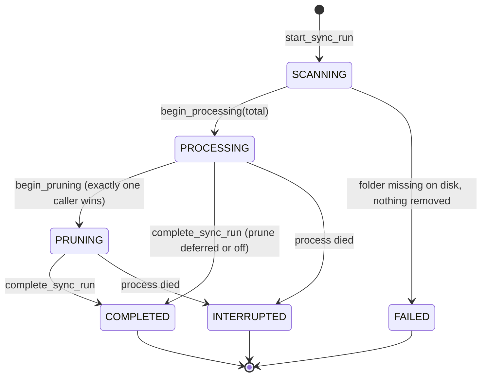
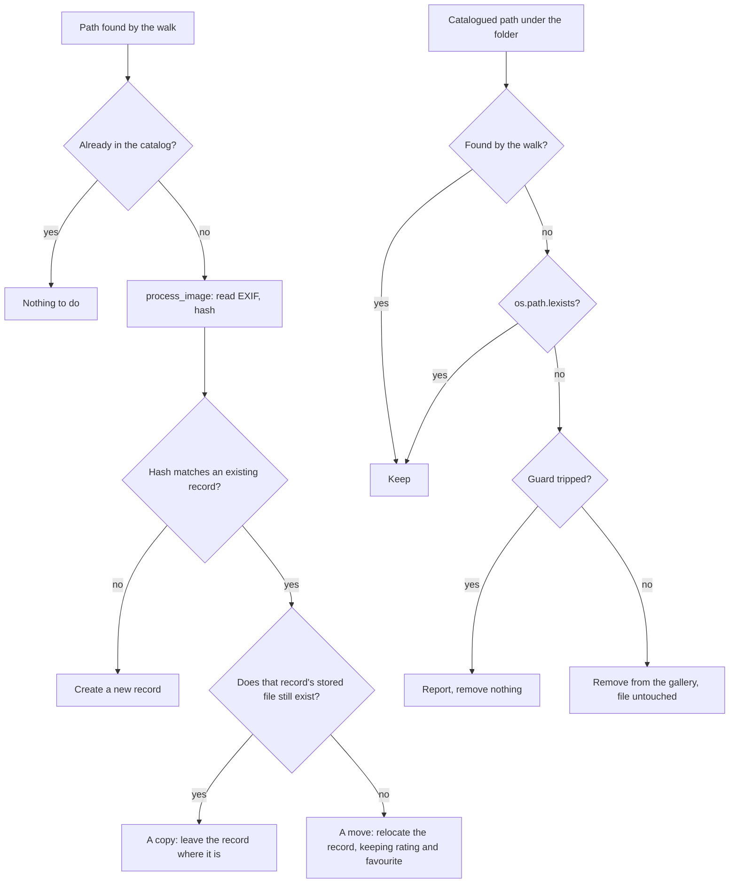

# ADR 013 — Library sync removes images that are gone from disk

**Status**: Accepted
**Date**: 2026-08-08
**Supersedes**: the *add-only sync* and *mtime gating* decisions of [ADR 010](010-image-library.md), and the *remove is pure deregistration* and *reset `last_checked_at` on a path update* decisions of [ADR 011](011-library-sync-on-folder-change.md) (everything else in both still stands)

---

## Context

ADR 010 introduced the Library and made its sync deliberately add-only: it walks each registered folder, diffs what it finds against every known `Image.filepath`, and imports what is new. ADR 011 kept that stance, stating that removing a folder "just deregisters it".

That was the right first step, but it leaves the catalog permanently wrong the moment anything on disk changes:

- a deleted photo stays in the gallery with a dead `filepath`, so its thumbnail and its full-size view both 404, forever;
- a renamed or moved photo is re-imported under its new path. The hash match in `find_existing_image_for_import` stops a duplicate row being created, but the record kept pointing at the old, nonexistent path;
- removing a folder from the Library left every image it had imported behind, with no way to tell where they came from.

The Library is presented to the user as the thing that keeps the gallery in step with their folders. In one direction it did not.

## Problem

"Keep the gallery consistent with the folders" sounds simple and is not, because the filesystem does not tell us what happened. It only shows us a before and an after. A move is indistinguishable from a delete plus an unrelated add unless something ties the two together. Several forces pull against each other:

- **User data lives on the record, not the file.** Rating, favourite and album membership are in the database. Treating a move as a delete plus an add silently throws them away.
- **Removal is destructive and, if we hard-delete, irreversible.** Every false positive is permanent, so the cost of over-removing is much higher than the cost of under-removing.
- **"Missing" is ambiguous.** An unplugged external drive, an unmounted network share and a directory that has become unreadable all look exactly like "the user deleted everything".
- **Two install modes** (ADR 003). In lite mode a sync finishes inline; in full mode the Celery tasks outlive the command that started them, so "the import is done" is not a moment the caller can observe.
- **Not every catalogued image belongs to the Library.** `manage.py process_images` imports from any folder, and those images must never be touched by a library prune.

So: how do we remove what is genuinely gone, without ever removing what is merely out of sight, and without losing user data to a rename?

## Scenario matrix

This matrix is the specification. Every numbered row has a matching test in `tests/integration/domain/library/test_prune_scenarios.py`, with the scenario number in the test name.

"Relocate" means the same `Image` record follows the file, keeping its rating, favourite flag and album membership. "Removed" always means removed from the gallery; **the image file itself is never touched**.

### File level, inside a tracked folder

| # | Scenario | Expected |
|---|---|---|
| 1 | File deleted | Image removed |
| 2 | File renamed in place | Relocate |
| 3 | File moved to another subfolder of the same tracked folder | Relocate |
| 4 | File moved to a different tracked folder | Relocate (see consequence 2) |
| 5 | File moved outside every tracked folder | Image removed |
| 6 | File copied, original kept | Nothing; hash dedup resolves the copy to the existing record |
| 7 | File copied, then original deleted | Record removed, copy re-imported next sync (see consequence 3) |
| 8 | File edited in place, same path, different bytes | Record keeps its path; content is not re-read |

### Directory level, inside a tracked folder

| # | Scenario | Expected |
|---|---|---|
| 9 | Subfolder deleted | Every image under it removed |
| 10 | Subfolder moved out of the tree | Every image under it removed |
| 11 | Subfolder renamed | Every image under it relocated, none removed |
| 12 | Subfolder moved in from outside | Imported as new |

### Folder level

| # | Scenario | Expected |
|---|---|---|
| 13 | Folder removed from the Library, "folder only" | Images kept |
| 14 | Folder removed from the Library, "and its images" | Images removed, except any another registered folder also covers |
| 15 | Folder's path edited because the folder itself moved | Every image relocated, none removed |
| 16 | Tracked folder missing on disk (unplugged drive) | Run fails, **nothing removed** |
| 17 | Nested folders both registered (`/Photos` and `/Photos/2024`) | Removing the inner one takes nothing the outer one still covers |
| 18 | Image imported by `process_images` from an untracked folder | **Never** removed |
| 19 | Symlinked subfolder, broken symlink, unreadable directory | Never removed |

---

## Decisions

### The app never touches your files

**"Remove" always means "remove from the gallery", never "delete from disk."** Nothing in this feature writes to, moves or deletes an image file. The only filesystem writes are to Filmcase's own derived thumbnail cache. Every piece of user-facing copy says so: the folder-removal dialog, the command output and the docs all say "remove from the gallery", never a bare "delete".

This is not decoration. The one case where a photo disappears from the gallery is the case where the user already deleted the file themselves, and a photo manager that is vague about which of the two it is doing is a photo manager nobody should trust with their library.

### Hard delete of the catalog row

The `Image` row is deleted outright, and its `FujifilmExif` row with it if that leaves it orphaned (the same garbage collection `merge_image_into` already does). The `FujifilmRecipe` is **never** deleted: recipes are shared, are the point of the app, and are worth keeping with no images left.

Two schema-level side effects are deliberately left alone rather than compensated for:

- `FujifilmRecipe.cover_image` is `SET_NULL`. Nulling it restores the automatic fallback to the recipe's most-used image, which `get_recipe_data` already resolves. Picking a replacement would fabricate an explicit user choice that was never made.
- `RecipeCard.image` is `SET_NULL`, and cards survive. A card is a rendered JPEG that stands on its own and outlives its source photo.

**Alternative considered: quarantine.** Mark the record instead of deleting it, hide it from the gallery, and offer a restore view. It neutralises the whole false-positive class and would let both the deferral rule and the two-phase lite sync below be dropped. It was rejected for now because it touches every gallery and filter query and adds a UI surface, for a single-user local app where the safety guard already covers the dangerous case. A cheaper version of the same idea, a `missing_since` timestamp requiring a path to be missing on two consecutive syncs, remains the obvious next step if the consequences below ever bite.

### A move is a relocation, not a delete plus an add

`relocate_image` repoints a record at its new path. An import that matches an existing record by content hash is either a move or a copy, and **the old file decides which**: if it is gone the bytes were renamed or moved and the record follows; if it is still there this is a second copy and the record stays put. That single test separates scenario 2 from scenario 6.

This also settles scenario 15 with no special case at all. After a folder's path is edited every file below it looks new, each hash-matches a record whose old path has gone, and every record relocates.

Ordering is what makes it work: **imports always run before the prune**. By the time anything is removed, a moved file has already repointed its record, so it no longer looks missing.

### Detecting what is missing: walk to narrow, stat to confirm

Two strategies were compared.

**Set difference from the walk** is cheap but produces false positives that hard delete makes permanent: `os.walk` does not follow symlinked directories, silently yields nothing for a directory it cannot read (its `onerror` default swallows `EACCES`), and matches only JPEG extensions, so any catalogued record it cannot see looks deleted.

**A stat per catalogued path** is exact but costs a syscall per image in the library.

**Chosen: the hybrid.** The set difference produces candidates; `os.path.lexists` on each candidate has the final say. Correctness is the stat approach's, cost is the walk's, because the candidate set is normally empty. `lexists`, not `exists`: a broken symlink still occupies the path, and for a destructive step "something is there" has to mean "keep the record".

### A mass-removal safety guard

A pass that would remove more than `LIBRARY_PRUNE_GUARD_FRACTION` of a folder's catalogued images, **and** more than `LIBRARY_PRUNE_GUARD_MIN_IMAGES` of them, is reported instead of applied. Both thresholds must be exceeded, so a small folder emptied on purpose and a large folder losing a handful are both applied without complaint. What the guard exists to catch is the shape of an unmounted drive: nearly everything gone at once.

`sync_library --force-prune` overrides it. `--dry-run-prune` reports what would go without removing anything. `--no-prune` imports only.

### A `PRUNING` run state, not a post-completion callback

`SyncRun.mark_completed()` was already an exactly-one-winner conditional update, so it looked like the natural hook. Pruning *after* it breaks three things: the HTMX poller stops before `removed` is written; a second sync of the folder can start while the prune is still walking, because the unique-active-run constraint no longer applies, and could re-import files the prune is about to remove; and a crash mid-prune leaves a run claiming `COMPLETED`.

Moving the election one step earlier into a `PRUNING` state fixes all three at once. `PRUNING` joins `ACTIVE_STATES`, so the constraint holds, the poller keeps polling, and `interrupt_active_sync_runs()` already recovers a crashed prune with no new code.

`mark_completed()` was replaced by a general `transition_state(from_states, to_state, finished_at)`. The guarded `UPDATE ... WHERE` stays on the model because it is a persistence concern (moving it into Python would make it a read-then-write race), but it carries no policy: which transitions are legal, and what each one means, belong to the domain operation that calls it.

### Where the prune runs

In the `finalize_sync_run` use case, which every possible last-caller reaches: each per-image task or thread as it finishes, and a dedicated task for a run that had no images at all. The domain never learns about Celery; the use case owns the orchestration.

**In full mode the prune always happens in the worker, never in whoever started the sync.** The tempting shortcut is to finalise inline when the scan found nothing new, since there is no work to hand off. That is exactly the pure-deletion case, so it would put a second full walk of the folder and every removal that follows it inside the startup command, before the server is reachable, or inside a web request. It would also mean the same work ran in the worker or in the caller depending only on whether anything happened to be new. Lite mode still finalises inline, because there is nothing to hand off to.

Failed and interrupted runs never reach it, which is scenario 16: a folder missing from disk fails its run and removes nothing.

Two protections against cross-folder moves (scenario 4):

- **Deferral.** Before pruning, the use case checks whether any *other* library folder still has images left to import. If one does, it defers; the next sync prunes. Delaying a removal is always safe, removing early is not. The test is images outstanding rather than merely an open run: a run that has accounted for every image cannot re-point anything, and treating it as a reason to wait would make a folder with nothing to import block its neighbours for no gain.
- **Two-phase lite sync.** Lite mode scans folders one after another, so deferral has nothing to see: folder A's prune would run before folder B had even been looked at. `sync_library` therefore imports every folder first with pruning off, then prunes each one.

### mtime gating is retired

`collect_image_paths` used to skip directories whose mtime predated the folder's `last_checked_at`. That has to go, because **renaming a directory updates its parent's mtime and never its own**. A renamed subtree keeps an old mtime, and `last_checked_at` only moves forward, so a gated walk never revisits it. Scenario 11 would have removed every image under a renamed folder and never found them again: permanent, silent loss.

The gate also bought almost nothing. `os.walk` has already listed each directory by the time the check runs, so the gate *added* a `getmtime()` per directory and saved only a filename suffix check. The expensive work, reading EXIF and hashing, was already avoided by the known-paths diff.

`last_checked_at` itself stays: it is shown in the Library page's "Last Checked" column and is the only evidence a sync ran when nothing changed. Only its gating role is gone, which also makes `clear_last_checked_at` (ADR 011's path-update reset) unnecessary.

### Removing a folder offers a choice

The Remove button opens a confirmation showing how many images come **only** from this folder, and offers "remove folder only" or "remove folder and its N images from the gallery", stating plainly that the files stay on disk. Ownership excludes anything another registered folder also covers, which is scenario 17 in both directions.

### Failures carry a code

`SyncRun.failure_reason` distinguishes `FAILED_FOLDER_MISSING` from any other failure. Before this, `sync_library` inferred "folder is missing" from `state == FAILED`, so every failure was reported as a missing folder, and the Library page showed a bare "Sync failed" with no reason at all. It now says:

> Folder not found on disk. Nothing was removed from the gallery.

That reassurance is the point. An unplugged drive looks exactly like a mass deletion, and it is the moment a user most needs to be told that nothing was lost.

---

## Consequences

1. **Hard delete makes every false positive permanent.** The `lexists` confirmation and the guard are the only nets. The `missing_since` two-strike scheme described above remains the cheapest way to remove that risk entirely.
2. **A cross-folder move is protected by deferral only while the other folder's run is active.** If the destination folder is registered much later, the source folder's prune has already removed the record and the destination re-imports it as new, losing rating and favourite.
3. **Copy-then-delete inside one sync window** (scenario 7) is self-healing but lossy for the same reason: the record goes with the original and the copy returns as a fresh import.
4. **The guard has a blind spot by design.** Needing *both* thresholds means wiping a 15-photo folder never trips it. That is intentional (it must not nag on ordinary cleanups) but it is the common case for small folders.
5. **The guard is per folder, not per subtree.** Deleting one 500-image subfolder from a 5,000-image library is 10%, so it is applied silently.
6. **`--force-prune` is global**, bypassing the guard for every folder in the pass. A per-folder "remove them" button on the Library warning is the natural follow-up; `prune_folder` already exists as a use case to back it.
7. **Two full walks per sync**, one to scan and one to prune, on top of retiring the gate. In full mode the second walk happens in the worker, so it does not hold up `make start`; in lite mode both run in the same process and could share their result if it ever bites.
8. **`PRUNING` is an active state**, so a process killed mid-prune blocks that folder from syncing until the next startup `interrupt_active_sync_runs()`. Same recovery model as `PROCESSING`, but a new window.
9. **A relocated image's cached thumbnail is orphaned**, not moved, and regenerates on the next view. Renaming folders is rare and regeneration is cheap. Removal *does* clear the cache, because cache keys are derived from the path and Fujifilm filenames wrap around from `DSCF9999` to `DSCF0001`: a later file reusing a path would otherwise be served the previous image's thumbnail.

---

## Diagrams

### Where the prune sits in a run

### Deciding a single file's fate

