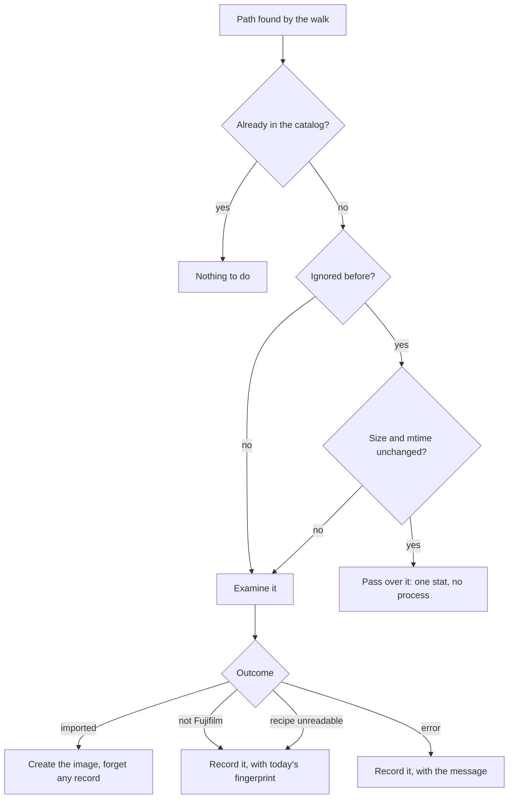

# ADR 014 — Remembering images that cannot be imported

**Status**: Accepted
**Date**: 2026-08-09
**Supersedes**: nothing. It repairs a consequence of [ADR 013](013-library-sync-removes-missing-images.md)'s decision to retire mtime gating, and revises that ADR's risk 7.

---

## Context

ADR 013 retired mtime-based directory gating, correctly: renaming a directory updates its parent's mtime and never its own, so a gated walk never revisited a renamed subtree, and once removal existed that would have silently dropped every image under a renamed folder.

What that ADR did not notice is what the gate had also been doing. A file the sync cannot import leaves **no trace of any kind**:

- `process_image` raises `NoFilmSimulationError` one line after the `exiftool` subprocess and before any database write;
- `InvalidFujifilmRecipeData` is raised inside `@transaction.atomic()`, so the `FujifilmExif` row created moments earlier is rolled back;
- an unexpected error persists nothing either.

The outcome survived only as a counter on `SyncRun` and a log line. Since the sync decides what is new by diffing found paths against `Image.filepath`, a file with no `Image` row is new **every single time**.

Under gating that cost was hidden: the file's directory was usually unchanged, so it was skipped. Without gating it is paid on every sync, forever.

Measured on a folder holding one non-Fujifilm JPEG, before this change:

```
run1: total=1 skipped=1
run2: total=1 skipped=1
run3: total=1 skipped=1
```

On a real 40,000-image library with ~14,500 non-Fujifilm JPEGs and 93 errored files, that is 14,589 `exiftool` processes per `make start`, every one reaching a conclusion already reached.

The same numbers caused a second, visible symptom. `sync_folder` published one Celery message per new file, synchronously, and `make start` runs `sync_library` to completion before starting the server. 14,589 messages, each resolving the same dotted path, running the structlog processor chain, acquiring from the producer pool and publishing a retry-wrapped AMQP frame, took roughly **40 seconds before the server was reachable**.

## Problem

Two questions, with one root cause between them:

- How does the sync stop reconsidering files it has already judged, without permanently condemning a file that might later become importable?
- How does dispatch stop being proportional to the number of files, when it sits on the critical path of startup?

Constraints that shape the answer:

- **"Cannot import" is not always permanent.** A non-Fujifilm JPEG never becomes importable; an error might be a locked file, a dead disk or a bug since fixed. Treating them identically is wrong in one direction or the other.
- **Re-deciding is expensive; re-checking need not be.** The verdict costs a process spawn and a full metadata parse. Whether the file still *is* what it was costs one `stat`.
- **Nothing may imply the file was touched.** Filmcase does not delete or modify photos (ADR 013). A list of thousands of "ignored" files invites exactly that fear.

## Decisions

### Remember the outcome, keyed to the file's state

A new `IgnoredImage` row records the path, why it was rejected, any detail, and the file's **size and modification time at the moment it was examined**.

A file whose fingerprint still matches cannot have become importable, so the sync passes over it for the cost of one `stat`. A file the user edits or replaces changes its fingerprint and is examined again **on its own**, with nothing to click. That is what makes remembering safe: the record is a statement about a particular version of a file, not a permanent verdict on a path.

Re-recording replaces the fingerprint. Without that, a file that changed, was examined again and failed again would keep its stale fingerprint and be re-examined on every sync from then on.

Success deletes the record, so one that no longer describes reality cannot show a photo that is in the gallery as though it had been rejected.

**Skips and errors are treated the same way**, rather than remembering only the deterministic rejections. Errors are far fewer but not free (93 files is 93 process spawns per startup), and the recorded message is what turns "93 errors" into 93 files a user can actually look at. The escape hatches below cover the transient case.

### Check only the candidates

The fingerprint check runs against paths that survived the known-paths diff, so the extra `stat` calls are bounded by how many files are ignored, not by the size of the tree. A folder with nothing ignored does no extra work at all.

### Batch the dispatch

One message per `SYNC_IMAGE_BATCH_SIZE` files instead of one per file, so 14,589 files become ~146 messages. Each image is still handled and accounted for individually inside the batch, so progress, ignore records and run completion are untouched; only the number of broker round trips falls.

`enqueue_tasks` also resolves the task once and logs once per call rather than per message. **Sharing a broker producer and skipping the result-backend call was considered and rejected**: batching removes two orders of magnitude of messages, after which per-message overhead is not worth the machinery.

### Give the records a page

A per-folder page lists them, paginated and filterable by reason. Without the filter the 93 errors are buried under 14,496 skips and unfindable, and the errors are the ones worth reading.

Three ways back: per-row retry, "retry all errors" (the common case: an environmental failure worth reconsidering without dragging thousands of non-Fujifilm files along), and "retry everything" behind a confirmation. `sync_library --retry-failed` does the same from the command line.

**Retry on an unchanged non-Fujifilm file is a genuine no-op** — it will be re-read and rejected again. The button is still offered, with wording that says so, rather than hidden (which removes control) or shown bare (which looks broken when nothing happens).

### Say plainly that nothing was touched

The page leads with it, the Library column carries it in its tooltip, and the retry confirmation repeats it. An "ignored" file was never imported; forgetting its record only means the next sync looks at it again.

---

## Consequences

1. **One more slow start after deploying.** The 14,589 files must be examined once to be recorded. Batching means the *command* returns quickly even while the worker is still busy.
2. **A file that changes without becoming importable costs one extra examination**, then settles again with a fresh fingerprint.
3. **mtime is the weak half of the fingerprint.** A tool that preserves modification time while changing content the same size would go unnoticed. Content hashing would close that, at the cost of reading every ignored file on every sync, which is the thing being avoided. Size plus mtime is the standard trade and the right one here.
4. **The batch task is a new task name, so the worker must be restarted once.** Messages queued under the old name are rejected as unknown; their run is recovered as interrupted on the next start and re-imported.
5. **A batch that dies loses the images it had not reached.** The run stays incomplete and is recovered as interrupted, exactly as a single dropped message was before.
6. **Nested folders**: a file is recorded against whichever registered folder synced it first, so it appears on that folder's page only. Uniqueness is on the path, so it is never recorded twice.
7. **`get_all_known_image_paths()` is still called once per folder**, so a 40k catalog is scanned once per registered folder per sync. Untouched here, and now the largest remaining fixed cost.
8. **`read_image_exif` still spawns one `exiftool` per image** with `-a -G1` and string-parses everything. That is the cost of a genuine first import, and the next real win.

---

## Diagram


