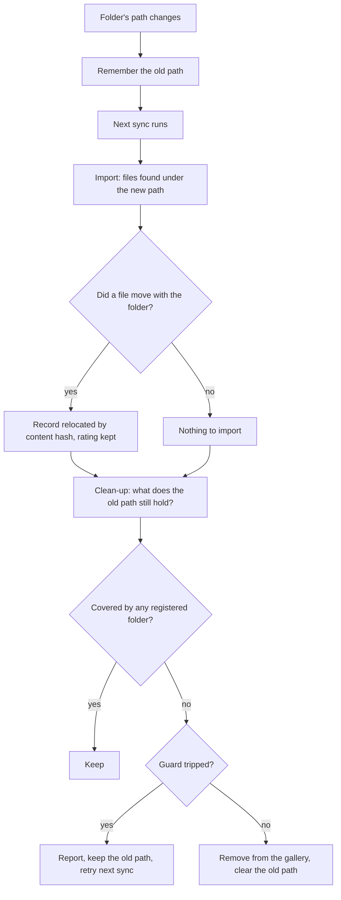

# ADR 015 — Cleaning up after a library folder's path changes

**Status**: Accepted
**Date**: 2026-08-10
**Supersedes**: nothing. It closes a gap in [ADR 013](013-library-sync-removes-missing-images.md), whose scenario 15 covered a folder that *moved* but not one that *narrowed*.

---

## Context

ADR 013 made the sync remove catalog entries whose files are gone, and scoped every prune to
`get_image_paths_under_folder(folder_path=folder.path)`. That scoping is what keeps images imported
from outside the library safe, and it is correct for every scenario in that ADR's matrix.

It has one blind spot. When a folder's path *changes*, images under the old path that are not under
the new one fall outside every registered folder, and a prune scoped to the current path can never
consider them again.

Reproduced on a scratch database. Register `/photos` holding `2023/` and `2024/`, sync, narrow the
folder to `/photos/2024`, then sync twice:

```
folder now: photos/2024
  in gallery: photos/2023/a.jpg
  in gallery: photos/2023/b.jpg
  in gallery: photos/2024/c.jpg
```

Then delete both 2023 files from disk and run `sync_library --force-prune`:

```
  still in gallery: photos/2023/a.jpg  file_on_disk=False
  still in gallery: photos/2023/b.jpg  file_on_disk=False
```

**Nothing could remove them.** The gallery showed photos whose files did not exist, permanently,
with no command able to fix it short of the database.

The end state is exactly scenario 5 of ADR 013, "file moved outside every tracked folder → image
removed", reached from the other direction: there the file moved off the folder, here the folder
moved off the file. Same end state, so the same rule should apply.

## Problem

`update_library_folder_path` overwrote the path and kept no record of the old one, so by the time a
sync ran, the information needed to clean up was gone.

The obvious fix — remove those images when the path changes — is wrong, and quietly so. Repointing
a folder that *moved on disk* (`/photos` → `/pictures`) relies on the next sync recognising the
files by content hash and relocating their records, which is what preserves ratings, favourites and
album membership (ADR 013). Removing them up front would delete precisely those records before
relocation could rescue them, and re-import every photo as new.

So one action, "the folder's path changed", needs two opposite outcomes depending on where the
files ended up, and the difference is only knowable after a sync has looked.

## Decisions

### The folder remembers where it pointed

`LibraryFolder.previous_path` holds the old path until the clean-up has run. That is the smallest
thing that carries the needed information across the gap between the edit and the sync.

**Recorded only when empty**, so two changes before a sync keep the original territory:
`/photos` → `/photos/2024` → `/photos/2024/january` must remember `/photos`, the widest and the one
actually holding the stranded images.

**Cleared only when the removal actually ran**, so a run stopped by the guard, deferred, or asked
for a dry run is retried on the next sync rather than forgotten.

### The clean-up runs after the sync, not at the edit

`remove_images_no_longer_covered` runs at run finalisation, immediately after the prune and behind
the same deferral rule. By then, anything that moved has followed its file into the new path and is
no longer a candidate, so the repoint case resolves itself with no special casing at all: the same
code produces removal for a narrowing and relocation for a move, because the sync has already
decided which happened.

This is the imports-before-removals ordering ADR 013 established, applied to a second kind of
removal.

### The guard applies

Narrowing a large folder can uncover most of it in one go. The mass-removal guard uses the images
under the *old* path as its denominator, so a small narrowing applies silently while a drastic one
is reported and skipped until `--force-prune`. Removal is a hard delete of ratings and favourites,
so an accidental path edit staying recoverable is worth one extra step.

### No confirmation dialog

The sync removes and reports, exactly as it already does for deleted files. A confirmation at edit
time would have to quote a number that is not yet knowable: for a moved folder it would warn that
thousands of images are about to go when in fact none will, because relocation rescues them all.

### A previous path counts as the folder's territory

`get_exclusively_owned_image_ids` treats a not-yet-cleaned-up `previous_path` as part of the folder.
Otherwise narrowing a folder and then removing it would strand the same images a second time, and
irrecoverably: the previous path goes with the folder row, leaving nothing to find them by.

---

## Consequences

1. **Removals now have two causes**, counted separately (`missing_found` and `uncovered_found`) and
   reported distinctly, so images disappearing after a path edit is explained rather than
   mysterious.
2. **One sync's delay.** The clean-up happens on the next sync, not at the edit. For the Library
   page that is immediate, since editing a path triggers a sync; for a path changed some other way
   it waits for the next one.
3. **A narrowing that is then undone costs nothing.** The photos were never touched, so re-widening
   the folder and syncing imports them again — though as new records, with their ratings gone.
4. **The guard can be tripped by a legitimate narrowing**, which then needs `--force-prune`. That is
   deliberate: it is the only barrier between a mistyped path and tens of thousands of hard-deleted
   catalog entries.
5. **Folder membership is still inferred from the file path.** `Image` has no link to the folder
   that imported it, which is what made this bug possible and what leaves nested folders ambiguous
   (an image below two registered folders belongs to both). A foreign key would end the guessing
   and make `process_images` imports exempt by construction rather than by path arithmetic. Not
   done here: it reworks scoping across code just written and verified, and needs a backfill over a
   40k-row table. **This remains the known structural weakness of the Library.**

---

## Diagram


