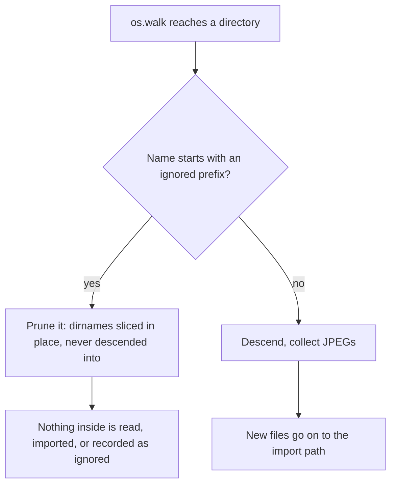

# ADR 017 — Skipping directories by name prefix

**Status**: Accepted
**Date**: 2026-09-02
**Supersedes**: nothing. It generalises the hardcoded `.`-prefix skip in `list_subdirectories` and closes a gap left open by [ADR 014](014-remembering-images-that-cannot-be-imported.md).

---

## Context

Filmcase's two library walks descend into every subdirectory they meet, and disagreed on one small point:

- `collect_image_paths` (the scan) used `os.walk` and never touched `dirnames`, so it entered everything.
- `list_subdirectories` (the folder browser) skipped only names starting with `.`.

A great many of the directories they entered are machine-generated and never hold user photos. A Synology NAS creates an `@eaDir` inside every indexed folder, holding its own generated thumbnails. Measured on a real library, folder `2026/07` held **72 real JPEGs and 107 files inside `@eaDir`**. QNAP leaves `@Recycle`, macOS leaves `.Spotlight-V100` and `__MACOSX`, Windows leaves `$RECYCLE.BIN` and `System Volume Information`.

Descending into these is not free, and the cost lands twice:

1. **Wasted work.** [ADR 014](014-remembering-images-that-cannot-be-imported.md) stopped the scan re-examining files it had already judged, but a thumbnail inside `@eaDir` still has to be judged *once*: an `exiftool` process is spawned at it, finds no film simulation, and the file is written into `IgnoredImage`. On seek-bound NAS hardware (rotational disks, no SSD, load near the core count while no process exceeds 5% CPU) the scan is bound by seeks, not CPU, so halving the files touched is worth more than any worker-concurrency setting.
2. **A buried signal.** The ignored-files page exists so a user can find the handful of files that genuinely failed. When it fills with Synology thumbnails, the real failures are unfindable — the opposite of what the page is for.

## Problem

- How does the scan avoid these directories entirely, rather than entering them and rejecting their contents one file at a time?
- How do the two walks stop disagreeing about what to skip?
- The set of junk directories is not fixed: it varies by operating system and NAS vendor, and a user may have their own. How is it made configurable without a code change?

Constraints that shape the answer:

- **Skipping must mean not visiting.** Rejecting a file still costs the process spawn and the metadata parse that this is meant to avoid, and still leaves an `IgnoredImage` row. The directory has to be pruned from the walk before its contents are enumerated.
- **One rule, not two.** A second copy of the skip logic is a second thing to keep in step; the browser and the scan had already drifted apart once.
- **Removal must stay safe.** The scan's found-paths set also drives the prune that removes catalogued images whose files have gone ([ADR 013](013-library-sync-removes-missing-images.md)). Excluding a directory must not make images look deleted.

## Decisions

### Skip by directory-name prefix, from a configurable list

A new dynamic setting `LIBRARY_IGNORED_DIRECTORY_PREFIXES` holds a comma-separated list of prefixes. A directory whose name starts with any of them is skipped. It is a runtime setting on Settings > Preferences > Library (constance-backed, like the prune guards), so a user on an unusual NAS can add a prefix without editing code or restarting.

The default set is chosen to cover the common cases across platforms:

| Prefix | Covers |
|---|---|
| `.` | Linux/macOS hidden dirs: `.Trash-*`, `.Spotlight-V100`, `.fseventsd`, `.AppleDouble`, `.git`, … |
| `@` | Synology `@eaDir`, QNAP `@Recycle` |
| `#` | Synology `#recycle` |
| `$` | Windows `$RECYCLE.BIN` |
| `System Volume Information` | Windows system folder |
| `__MACOSX` | macOS zip-archive artifact directory |

**Prefix matching, not exact names or globs, is deliberate.** It is what the real cases need — every example above is distinguished by how its name begins — and it stays a one-line rule. The cost is that a prefix matches anywhere a name begins, so `@` also hides a folder a user deliberately named `@work`. That is stated in the setting's help text rather than papered over with a cleverer matcher: a user who wants `@work` scanned removes `@` from the list, and the behaviour is predictable.

### Prune the walk, so nothing inside is ever visited

The scan mutates `os.walk`'s `dirnames` **in place** — `dirnames[:] = [...]` — so the walk never recurses into a skipped directory. Rebinding the name (`dirnames = [...]`) would be a silent no-op that leaves the walk descending into everything; the in-place slice assignment is the whole point and is commented as such. Because the directory is never entered, its files are never enumerated, never stat'd, never hashed, never handed to `exiftool`, and never written to `Image` or `IgnoredImage`. The files are not analysed and rejected — they are not seen.

### One shared predicate for both walks

`directory_name_is_ignored(name, prefixes)` is defined once, in the settings domain that owns the setting, and called by both `collect_image_paths` and `list_subdirectories`. The `.`-only skip the browser used to hardcode is now just the `.` in the default list. The two walks can no longer drift apart.

### Leave the rows already recorded

Rows written into `IgnoredImage` by past scans of these directories are not cleaned up by this change. They stay on the ignored-files page until the user clears them there; future scans simply stop adding new ones. A migration or command to bulk-remove them was considered and rejected as out of scope: the rows are harmless, the page can already clear them, and guessing which historical rows came from a now-ignored directory is exactly the kind of destructive heuristic ADR 013 and 014 avoid.

---

## Consequences

1. **Skipped directories vanish from the ignored-files page over time, but not retroactively.** New scans stop recording their contents; existing rows remain until cleared by hand.
2. **A user with a legitimately prefixed folder must adjust the list.** `@work` is hidden by the default `@`. The setting is editable and the help text says so, but the default is opinionated.
3. **No false prune on removal.** The skipped directories' files never became real `Image` rows, so leaving them out of the scan's found-paths set cannot make any catalogued image look deleted. The guard in `remove_missing_images` is unaffected.
4. **The rule is prefix-only.** A junk directory that does not share a name prefix with anything (an oddly named vendor cache) is not covered until a user adds its prefix. Exact-match and glob support were not built because no real case needs them yet.
5. **Both walks now read one dynamic setting per call.** A single constance read at the top of each walk, negligible against the filesystem work that follows.

---

## Diagram

