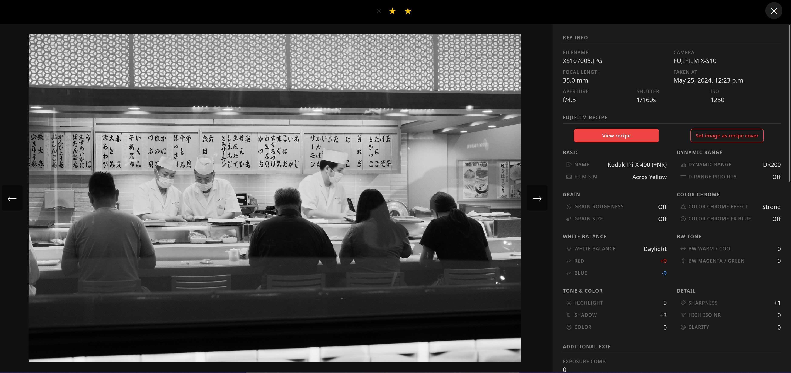
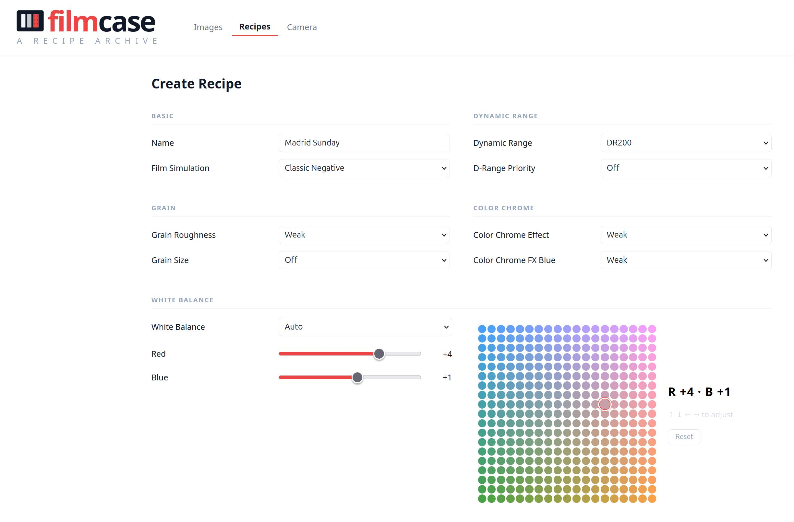
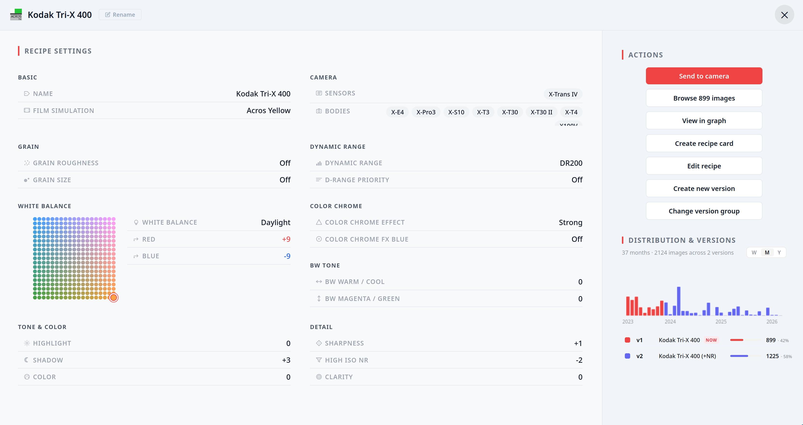
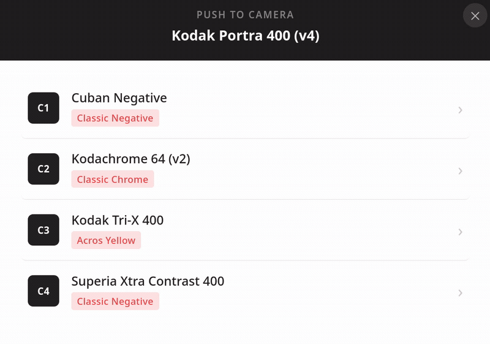
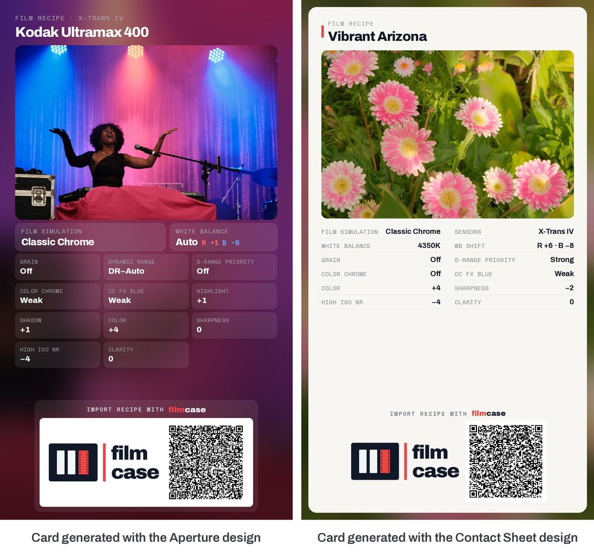
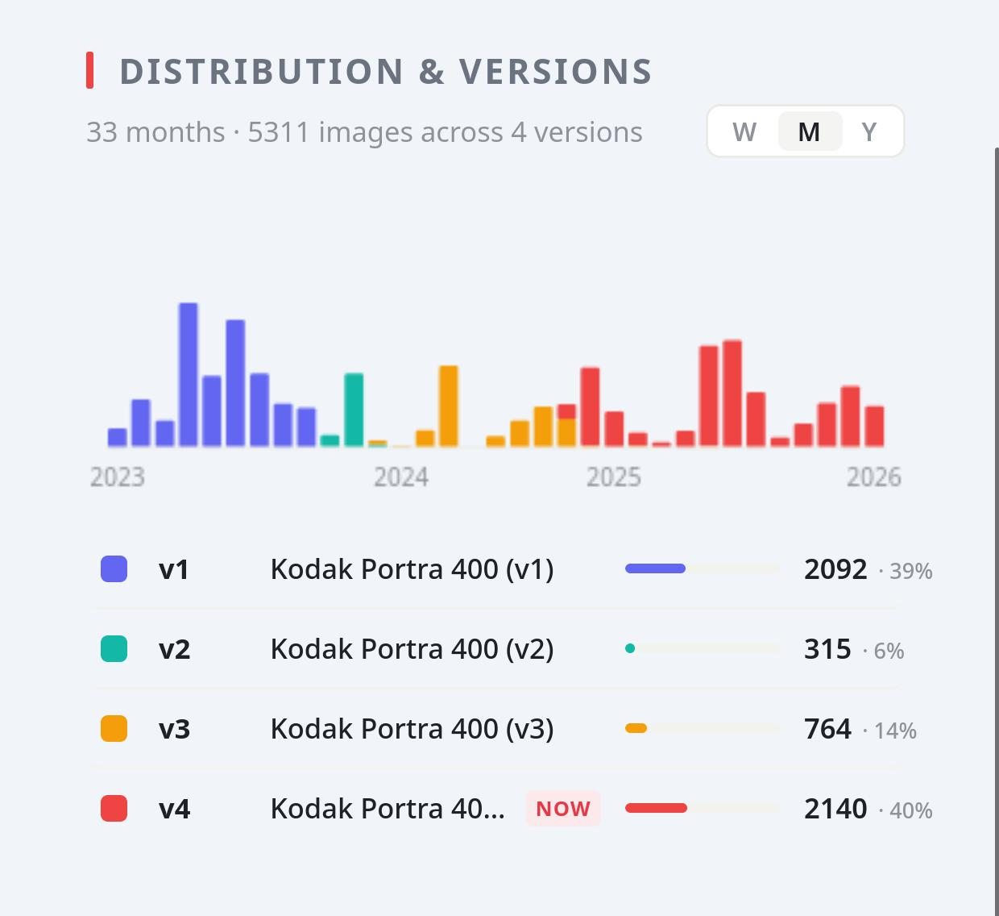
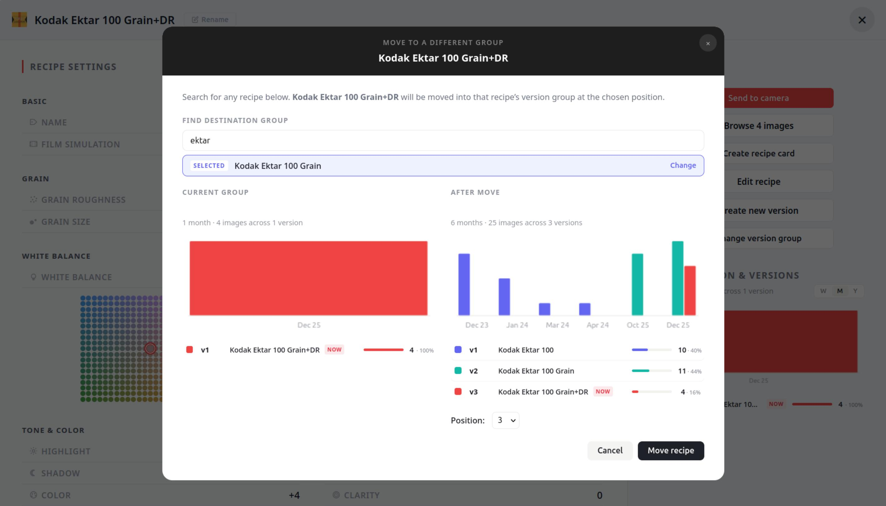

# Web Interface

## Contents

- [1 Library](#1-library)
  - [1.1 Managing folders](#11-managing-folders)
  - [1.2 Files that could not be imported](#12-files-that-could-not-be-imported)
  - [1.3 Automatic sync on startup](#13-automatic-sync-on-startup)
- [2 Images](#2-images)
  - [2.1 Gallery](#21-gallery)
    - [2.1.1 Filtering](#211-filtering)
    - [2.1.2 Bulk actions](#212-bulk-actions)
  - [2.2 Image Detail](#22-image-detail)
- [3 Recipes](#3-recipes)
  - [3.1 Explorer](#31-explorer)
  - [3.2 Importing, creating & deleting recipes](#32-importing-creating--deleting-recipes)
  - [3.3 Recipe Detail](#33-recipe-detail)
    - [3.3.1 Send recipe to camera](#331-send-recipe-to-camera)
    - [3.3.2 Create recipe card](#332-create-recipe-card)
    - [3.3.3 Distribution & versions](#333-distribution--versions)
      - [3.3.3.1 Creating a new version](#3331-creating-a-new-version)
      - [3.3.3.2 Grouping existing recipes](#3332-grouping-existing-recipes)
  - [3.4 Graph](#34-graph)

## 1 Library

The Library page lets you register the folders on your filesystem where your Fujifilm JPEGs
live. Filmcase uses these registrations to keep your catalog up to date automatically each
time you start the app.

### 1.1 Managing folders

Each row in the library table shows a registered folder path together with the last time that
folder was checked and the last time new images were found in it.

- **Add a folder**: click _Add Folder_ and use the filesystem browser to navigate to the
  directory you want to register. Subfolders are included automatically; you do not need to
  register them separately.
- **Update path**: if you move a folder on disk, click _Update Path_ on its row and pick the
  new location. The folder's sync history is preserved, and the photos inside it keep their
  ratings and favourites: they are recognised at the new location rather than re-imported.
- **Remove**: click _Remove_ to unregister a folder. A confirmation appears showing how many
  images in the gallery come only from that folder, and offers two choices: remove the folder
  only, leaving its images in the gallery, or remove the folder and take those images out of
  the gallery too. **Neither option deletes a photo file**; your files stay on disk. If folders
  are nested, removing the inner one never takes images the outer one still monitors.

### 1.2 Files that could not be imported

Each folder row shows how many of its files the sync could not import, linking to a page that lists
them with the reason and, for failures, the error message. Photos from other camera brands are the
usual bulk of it.

**None of these files has been deleted or changed.** They were never imported, so they are simply
not in the gallery. Filmcase remembers them so it does not re-read them on every sync, and examines
any of them again automatically if the file itself changes.

The page can be filtered by reason, which is how you find the handful of genuine errors among
thousands of "not a Fujifilm photo" entries. You can retry one file, retry every error at once, or
retry everything. Retrying a non-Fujifilm file that has not changed does nothing, and the page says
so on the row.

### 1.3 Automatic sync on startup

Every time you start the app with `make start`, Filmcase runs a sync pass across all
registered library folders before the web server comes up. New images are imported
automatically; images already in the catalog are skipped, and entries whose files have
disappeared are taken out of the gallery. See
[Library Sync](library_sync.md) for a full explanation of how the sync works.

Two warnings can appear in a folder's **Sync** column:

- **Folder not found on disk.** The folder is registered but is not there, usually because an
  external drive is not plugged in. Nothing is removed from the gallery when this happens.
- **Skipped removing N missing images.** Most of the folder's images looked missing at once,
  which is far more often an unmounted drive than a real deletion, so the removal was reported
  rather than applied. Hover for the explanation and the command that overrides it.

---

## 2 Images

### 2.1 Gallery

The main gallery shows all imported images as a scrollable grid. As you scroll down, more
images load automatically.

#### 2.1.1 Filtering

A sidebar lets you narrow the gallery by recipe settings: film simulation, dynamic range,
grain, white balance, and other creative fields. Filters update the grid without reloading
the page.

Filtering is **faceted**: selecting a value in one field instantly updates the available
choices in every other field to only show combinations that exist in your library. You can
select **multiple values within the same field** (e.g. Provia and Velvia at once), and images
matching any of those values are shown. Values that have been selected but are no longer
reachable given the other active filters are shown greyed-out; unchecking a conflicting
filter brings them back.

You can also **filter by recipe** using the searchable multi-select at the top of the
sidebar. Choosing one or more recipes narrows all other filter options to that recipe's
images, and conversely, active field filters update the recipe list to reflect only recipes
that have matching images.

A **Clear all filters** link at the top of the sidebar resets everything in one click.

You can also enable **Rating first** to sort the grid by rating (highest first), so your
best-rated images always appear at the top.

#### 2.1.2 Bulk actions

The gallery supports **multi-select mode** for acting on several images at once. Click any
image card's checkbox (or click a card while another is already selected) to enter selection
mode, then open the _Actions_ menu to choose what to do with the selection.

- **Set rating**: a modal shows how many images are selected and the same star widget used
  in the image detail view. Pick a rating (or the ✕ to clear it) and confirm to apply it to
  every selected image at once. The gallery reloads when you close the modal so the updated
  star counts appear on the cards.

---

### 2.2 Image Detail

Clicking an image opens a full-resolution detail view with all of its EXIF information,
including the complete recipe the camera had active at the time of shooting.

From the detail view you can:

- **Browse** to the previous or next image within your current filter, without going back to
  the gallery.
- **Rate the image** using the star widget (0–5). Click a star to set that rating; click the
  clear button (✕) to reset it to 0.
- **View the recipe**: jump to the full recipe detail view for the recipe this image was
  shot with.
- **Set as recipe cover**: mark this image as the cover photo for its recipe, replacing
  whatever was shown before.

---

## 3 Recipes

### 3.1 Explorer

The recipes explorer lets you browse and search your entire recipe collection in one place.
You can filter by film simulation, dynamic range, grain, and other settings using the same
faceted filtering available in the image gallery.

Each recipe is shown with a cover image drawn from your library. The cover is
**customizable**: you can pick any photo associated with that recipe to represent it.

---

### 3.2 Importing, creating & deleting recipes

Recipes can be **imported** in two ways directly from the explorer:

- **From a Fujifilm JPEG**: the app reads the recipe embedded in the file's EXIF data.
- **From a recipe card**: upload a recipe card image (a QR code shared by another
  Fujifilm shooter) and the recipe is added to your library automatically.

Alternatively, you can **create a recipe manually** using the _Create Recipe_ button.
This opens a form where you can dial in every parameter (film simulation, tone, grain,
white balance, and more) without needing a source image or card.

Recipes can be **deleted** using the multi-select mode. Click any recipe card's checkbox
(or click a card while another is already selected) to enter selection mode, then open the
_Actions_ menu and choose _Delete recipes_. A confirmation modal lists how many recipes will
be removed and offers an optional checkbox to also delete any recipe card files generated for
those recipes. Recipes that still have images associated to them cannot be deleted; the modal
reports these as failures and leaves them untouched. After a fully successful deletion the
page reloads automatically when you close the modal.

---

### 3.3 Recipe Detail

The recipe detail view is the heart of the app. A **recipe** (the exact set of Fujifilm
camera settings that produces a particular look) is the central concept everything else
revolves around, and this page is where you manage one. It shows all of a recipe's settings at
a glance and lets you **rename** it (25 ASCII characters, matching the camera's own slot
naming rules; see [recipe_naming.md](recipe_naming.md)), **edit** its parameters, jump to the
**images taken with it**, and **send it to your camera**.

Editing is guarded: if the recipe has no images associated with it, every parameter can be
changed; once it has images, only the name is editable, so the camera settings stay faithful
to the historical shooting data tied to those photos. When a recipe is locked this way, you
can instead fork it into a new version (see [Distribution & versions](#333-distribution--versions)).

The most important tools on this page are described below.

#### 3.3.1 Send recipe to camera

Loading recipes onto the camera is one of Filmcase's most compelling features: Fujifilm ships
no official app that pushes recipes to a camera for this direct purpose, so this fills a real
gap.

It requires the camera to be connected to the computer over USB and set to the
**USB RAW CONV./BACKUP RESTORE** mode. To connect the camera successfully:

1. Set the camera to that mode in **Menu → Setup → Connection Settings → Connection Mode**.
2. Turn the camera off.
3. Connect the camera via USB.
4. Turn the camera on, and it should boot straight into that mode.

Once the camera is in that mode, clicking **Send to Camera** doubles as a connectivity check:
the first thing the app does is read all of the C1–C7 slots to populate the slot-selection
window. If the connection is healthy, every slot is shown along with the recipe currently
stored in it; if it is not, an error is displayed instead.

Once the slots load, you can be confident the recipe will push correctly. Select the slot you
want the recipe to go to (replacing whatever is currently there), and the write takes a couple
of seconds, depending on the recipe, the camera, and the cable.

#### 3.3.2 Create recipe card

Filmcase runs entirely on your own machine, but recipes are meant to be shared, whether with
other Filmcase users or the wider Fujifilm community. A **recipe card** is the tool for that:
a plain JPEG you can post to any social platform or chat that shows the full recipe as a
human-readable list **and** carries an encoded copy of it in a QR code that any QR reader can
scan. Filmcase ships with a built-in importer that reads the QR straight back into your
library, so whether your audience is another Filmcase user or just someone who wants to try a
new look on their own camera, a card is an easy way to pass a recipe along.

Because the recipe lives inside the image itself (both as text and in the QR), it survives the
EXIF stripping that social platforms apply to uploads. The QR is the same size and encoding
across every design, and colour and black-and-white recipes automatically show the relevant
fields (for example the BW tone fields for Acros/Monochrome sims, or `Color` for colour sims).

> **Note:** the QR encodes a plain, non-obfuscated JSON specification of the recipe. An open
> format for recipe transfer is in the works.

Three designs are available, selected from tabs in the creation modal:

- **Classic**: a square 1080×1080 card with a photo or gradient background, a translucent
  settings panel, and a corner QR. Options let you choose full or short field labels, a
  blurred or sharp background, and which side holds the info panel.
- **Aperture**: a portrait 1080×1920 (9:16, sized for Instagram Stories/Reels) card: a
  blurred, darkened version of your photo behind a hero image, frosted-glass parameter tiles,
  and a bottom "import" module with the logo and QR. The darkening gradient is tunable via the
  `RECIPE_CARD_APERTURE_SCRIM_TOP_OPACITY` / `RECIPE_CARD_APERTURE_SCRIM_BOTTOM_OPACITY`
  settings.
- **Contact Sheet**: a portrait 1080×1920 light "paper" spec-sheet listing every parameter in
  two columns over a blurred photo frame.

The photo-centric designs (Aperture and Contact Sheet) are built around a real example photo,
so they require a background image; the gradient-background option is offered only for Classic.
See [ADR 012](ADRs/012-pluggable-card-designs.md) for the design architecture.

#### 3.3.3 Distribution & versions

Finding a recipe online or dialing in your own is only the start of getting to know it. As you
shoot with a recipe you often discover parameters worth tweaking to move it closer to the look
you are after. Other times the original carries settings that are not to your taste: you might
prefer to turn grain off while keeping everything else the same, or drop clarity back to 0 to
avoid the shutter delay it adds when operating the camera. Recipes, in other words, evolve over
time, and it is useful to track that history by grouping related recipes into **version
timelines**.

Filmcase has this built in. When you first create or import a recipe it starts its own
dedicated timeline. From the recipe detail view you can add **new versions** of it, and you can
also **group recipes that already exist** so they share one timeline.

Finally, a panel visualises how your shooting with this recipe is distributed over time, broken
down by version: a bar chart plots image counts per time bucket, with a **W / M / Y** toggle to
switch the bucket size between week, month, and year.

##### 3.3.3.1 Creating a new version

If a recipe is locked (because it already has images), a _Create new version_ button forks it
into a tweaked copy, pre-populated with the current settings so you only change what differs.
Both recipes stay linked in the same timeline, letting the app trace how a recipe has been
refined across shoots.

##### 3.3.3.2 Grouping existing recipes

To bring separate recipes together, a _Change version group_ button moves the recipe out of its
current timeline and into a different one. It opens a modal with two columns: the left shows the
current timeline's distribution chart and version list; the right shows a live preview of the
destination timeline after the recipe is inserted. Type any part of a recipe name to search for
a destination; results list recipes from other timelines with their member count. A
**Position** dropdown chooses exactly where the recipe lands (1 through N+1, where N is the
current member count), and the preview updates as you change it. Click **Move recipe** to apply.
If the recipe was the only member of its original timeline, that timeline is deleted
automatically; the recipe's own images and history are preserved.

---

### 3.4 Graph

Each recipe has a visual graph showing how it relates to your other recipes: which ones are
close, how many settings differ between them, and how you can trace the path from one to
another. See [Recipe Graphs](recipe_graphs.md) for a full explanation of the graph views and
what you can do from them.
